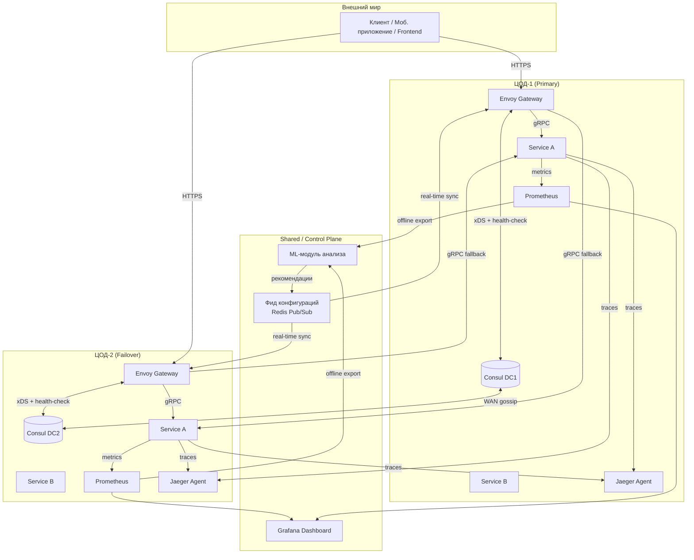

# ADR-0001: Платформа гео-распределённого управления трафиком с автоматическим failover на базе Envoy + Consul

| Поле | Значение |
|---|---|
| **Статус** | `Proposed` |
| **Дата** | 2026-03-31 |
| **Авторы** | @technicheskoye_team |
| **Ревьюеры** | @yolo |

---

## 1. Контекст и постановка задачи

### 1.1 Бизнес-логика и требования

**Ключевые бизнес-процессы:**

- [x] **Маршрутизация межрегионального трафика**: автоматическое направление запросов в ближайшую исправную зону на основе гео-локации и состояния сервисов
- [x] **Автоматический failover**: при деградации или отказе дата-центра трафик бесшовно переключается на резервный ЦОД без участия оператора
- [x] **Адаптивная балансировка**: динамическая подстройка весов маршрутизации на основе метрик производительности и рекомендаций ML-модуля

**Ожидания заказчика (SLA):**

> Укажи конкретные числа: время ответа, доступность, RPS.

| Метрика | Значение | Измерение |
|---|---|---|
| Latency (p99) | ≤ 200 ms | Prometheus/Grafana |
| Доступность | ≥ 99.9% | SLO мониторинг |
| Пиковый RPS | ≥ 1000 | k6 / wrk нагрузочное тестирование |
| Время failover | ≤ 30 сек | E2E тесты с симуляцией отказа |

**Out of Scope:**

- _Онлайн-инференс ML-модуля_ — вынесено в ADR-0043 / Q3 2026
- _Мульти-регион > 2 ЦОД_ — архитектура масштабируема, но в scope только 2 дата-центра
- _Шифрование трафика между ЦОД (mTLS)_ — вынесено в отдельный эпик безопасности

---

## 2. Предлагаемое решение

### 2.1 Диаграмма решения



### 2.2 Модель данных и хранение

**Оценка объёмов:**

| Сущность | Строк/документов | Прирост в день | Стратегия |
|---|---|---|---|
| Service Registry (Consul) | ~50 сервисов × 2 DC | ±5 сервисов/неделю | TTL-based cleanup, 24h retention |
| Config Snapshots (Redis) | ~1000 записей | ~50 обновлений/день | LRU eviction, 7d TTL |
| Metrics (Prometheus) | High-cardinality | ~10M samples/day | Downsampling + remote write to long-term storage |
| Trace Spans (Jaeger) | ~1M spans/day | Растёт линейно с RPS | Sampling 10%, 30d retention |

**Схема конфигурации (упрощённая):**

```yaml
# envoy-route-config.yaml
routes:
  - match: { prefix: "/api/v1" }
    route:
      cluster: service-a-primary
      retry_policy:
        retry_on: "connect-failure,refused-stream,unavailable"
        num_retries: 3
        per_try_timeout: 2s
      fallback_cluster: service-a-failover-dc2
      
clusters:
  - name: service-a-primary
    type: STRICT_DNS
    lb_policy: LEAST_REQUEST
    health_checks:
      - timeout: 1s
        interval: 5s
        unhealthy_threshold: 2
        http_health_check: { path: "/health" }
```


### 2.3 API и интерфейсы

**Потребители (consumers):**

| Потребитель | Тип интеграции | Частота вызовов |
|---|---|---|
| Внутренние сервисы WB | gRPC | Надеюсь выдержим |
| ML-модуль | Prometheus Query API | Раз в 5 минут (офлайн) |

---

## 3. Информационная безопасность

| Тип данных | Обрабатывается? | Меры защиты |
|---|---|---|
| Персональные данные (ПДн) | Нет (только X-User-ID как анонимный идентификатор) | Маскирование в логах, не сохраняется в БД |
| Платёжная информация | Нет | Не обрабатывается на уровне шлюза |
| Токены / API-ключи | Да (внутренние service-to-service токены) | Передаются в заголовках, не логируются |

---

## 4. Интеграции и зависимости

| Сервис / команда | Тип зависимости | Что произойдёт при отказе | Ответственный |
|---|---|---|---|
| Consul (WAN gossip) | Синхронная (health-check) | Failover не сработает, трафик останется в деградировавшем ЦОД | Влад |
| Deploy | Синхронная (health-check) | Продумать поведение | Юра |
| Prometheus | Асинхронная (метрики) | Потеря наблюдаемости, но система продолжает работать | Возможно Антон |
| ML | Асинхронная (трейсы) | Некритичная потеря обновления конфигов, переключение на эвристики | Антон |

---

## 5. Альтернативы

| Альтернатива | Плюсы | Минусы | Почему отказались |
|---|---|---|---|
| **Envoy + Consul (выбранный)** | Легче настроить | Меньше гибкости (как раз этим и занимаемся) | 
| **Istio + Kubernetes** | Высокоуровневые абстракции, Встроенный mTLS | Heavyweight, Требует K8s | Зависимость от кубера |

---

## 7. Декомпозиция

### Видение (архитектурное)

После завершения работ система представляет собой самодостаточную платформу из двух географически изолированных дата-центров, где входящий трафик автоматически маршрутизируется в ближайший исправный ЦОД. Операторы управляют системой через Infrastructure as Code, а ML-модуль постепенно оптимизирует балансировку на основе реальных метрик.

### Оценка трудозатрат

| Задача | Оценка (ч/дн) | Исполнитель |
|---|---|---|
| Настройка Envoy Gateway (xDS, fallback-логика) | 5 | Юра |
| Интеграция Consul WAN gossip + health-checks | 5 | Влад |
| Реализация 10 сервисов-стабов на Go/gRPC | 4 | Савелий |
| Настройка Prometheus + Grafana дашбордов | 2 | Антон |
| ML-модуль training + inference | 5 | Савелий |
| Разработка скрипта генерации трафика (k6) | 2 | Савелий |
| Инфраструктура как код (Docker Compose, сети) | 3 | Юра |
| Тестирование failover сценариев (E2E) | 3 | Еще кто-то |
| Документация + runbook | 5 | Миша |
| **Итого** | **до апреля** | |

---

## 8. Test Notes

**Сложная логика и corner cases:**

- [ ] **Race condition при одновременном отказе обоих ЦОД**: система должна вернуть 503 с понятным сообщением, а не зависнуть
- [ ] **Частичная деградация**: если в ЦОД-1 упал только Service A, трафик на Service B должен оставаться локальным
- [ ] **Восстановление после failback**: при возврате ЦОД-1 в строй трафик должен плавно вернуться (не резкий переключатель)
- [ ] **Граничные значения заголовков**: `X-User-ID` пустой / слишком длинный / не-ASCII — Envoy должен корректно проксировать или отклонить
- [ ] **Параллельные обновления конфигурации**: два одновременных push в config feed не должны приводить к inconsistent state

**Падение зависимостей:**

| Сценарий | Ожидаемое поведение |
|---|---|
| Consul вернул устаревший health-check | Envoy использует локальный кэш + circuit breaker, не направляет трафик в "мёртвый" сервис |
| Redis (config feed) недоступен | Envoy продолжает работать на последней известной конфигурации, алерт в Prometheus |
| Prometheus down | Система работает, но нет метрик для алертов и ML-анализа |
| Jaeger недоступен | Трейсы теряются, но бизнес-логика не страдает |

**Транзакции и идемпотентность:**

- [ ] Повторный запрос с тем же `X-Request-ID` не создаёт дублей на уровне бизнес-сервисов (идемпотентность обеспечивается сервисами)
- [ ] При сбое во время failover запрос не теряется: клиент получает ошибку и может повторить (retry с backoff на стороне клиента)
- [ ] Envoy реализует экспоненциальный backoff для retry-попыток

---

## 9. Наблюдаемость (Observability)

> Как мы узнаем, что система работает правильно (или сломалась)?

**Бизнес-метрики:**

| Метрика | Описание | Инструмент |
|---|---|---|
| `traffic.failover.count` | Количество срабатываний failover за период | Prometheus + Grafana |
| `traffic.geo_distribution` | % трафика по ЦОД (балансировка) | Grafana heatmap |
| `user.session.success_rate` | Успешность сессий по `X-User-ID` | DataLens (агрегация из Prometheus) |

**Технические метрики:**

| Метрика | Норма | Алерт при |
|---|---|---|
| Request rate (per DC) | 500±200 RPS | < 100 RPS или > 1200 RPS |
| Error rate (5xx) | < 1% | > 5% в течение 2 минут |
| Latency p99 (end-to-end) | < 200ms | > 500ms |
| Consul health-check failures | 0 | > 3 сервиса в одном ЦОД |
| Envoy config update latency | < 1s | > 5s |

**Алерты:**

- [ ] Алерт на `error_rate > 5%` → on-call (PagerDuty)
- [ ] Алерт на `failover_triggered` → канал #traffic-alerts + тимлид
- [ ] Алерт на `consul_wan_partition` → SRE-команда
- [ ] Dashboard в Grafana: [traffic-platform-overview](https://grafana.wb.ru/d/traffic-geo)

**Логирование:**

- [ ] Structured logs в JSON (field: `dc_id`, `route_decision`, `fallback_used`)
- [ ] Уровень ERROR содержит stack trace и `request_id`
- [ ] Заголовки `X-User-ID` / `X-Cabinet-ID` логируются только в debug-режиме, в prod — хешируются

---

## 10. Чек-лист рисков (Pre-release)

> Заполни перед выходом в продакшн. Все пункты должны быть закрыты или объяснено, почему неприменимо.

### Готовность к релизу

- [ ] ADR прошёл ревью и статус `Approved`
- [ ] Код прошёл code review (минимум 2 апрувера)
- [ ] Все тесты зелёные в CI/CD (unit + integration)
- [ ] Нагрузочное тестирование проведено: 1000 RPS × 1 час без деградации
- [ ] Секреты и конфиги вынесены в env / Vault, не захардкожены

### Безопасность

- [ ] Валидация входящих заголовков реализована (reject malformed)
- [ ] ПДн не логируются в явном виде (проверено сканером)
- [ ] Уязвимости из SAST-сканера (Trivy) устранены или задокументированы как ложные срабатывания

### Операционная готовность

- [ ] Runbook написан: [runbook.md](https://git.wb.ru/traffic/platform/-/blob/main/docs/runbook.md)
- [ ] Дашборды и алерты настроены в staging
- [ ] On-call ознакомлен с изменениями (демо + документация)
- [ ] Rollback план протестирован на staging

---

## 11. План релиза и отката

### Стратегия деплоя

> Как деплоим? Canary, blue-green, feature flag, прямой деплой?

- **Стратегия**: feature flag + canary по ЦОД
- **Шаги деплоя**:
  1. Развернуть инфраструктуру в staging (2 ЦОД, изолированные сети)
  2. Прогнать E2E тесты с симуляцией отказа
  3. Включить feature flag `geo-failover-enabled` для 1% трафика в prod-подобном окружении
  4. Мониторинг 24 часа: метрики, логи, алерты
  5. Постепенный rollout: 10% → 50% → 100% трафика
  6. Отключить старый механизм маршрутизации (если был)

### Обратная совместимость

- [x] API шлюза обратно совместим: старые клиенты работают без изменений
- [x] Миграция Consul-конфигурации обратно совместима (поддерживает старые форматы)
- [x] Docker Compose манифесты версионируются, откат — `git checkout` + `docker-compose up`

### План отката (Rollback)

> Что делать, если что-то пошло не так?

| Шаг | Действие | Ответственный | Время |
|---|---|---|---|
| 1 | Обнаружили проблему по алертам (error rate / latency) | on-call | — |
| 2 | Отключить feature flag `geo-failover-enabled` | DevOps / разработчик | < 2 мин |
| 3 | При необходимости: `docker-compose down && git revert && up` | DevOps | < 10 мин |
| 4 | Проверить, что трафик пошёл по старому маршруту | разработчик | < 5 мин |
| 5 | Уведомить стейкхолдеров в #incidents | тимлид | < 15 мин |
| 6 | Провести post-mortem в течение 48ч | вся команда | 48ч |

**Триггеры для отката:**

- Error rate > 10% в течение 5 минут
- p99 latency > 1000ms для > 50% запросов
- Consul WAN partition > 60 секунд
- Критическая ошибка: потеря > 5% запросов при failover
