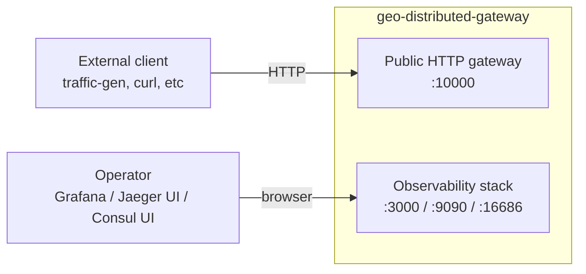
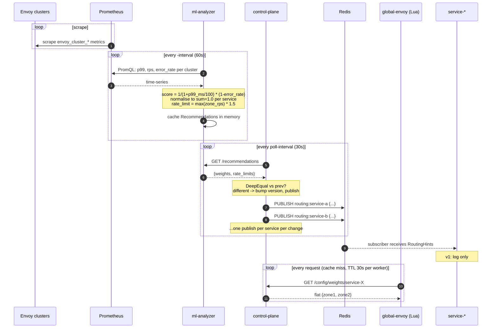
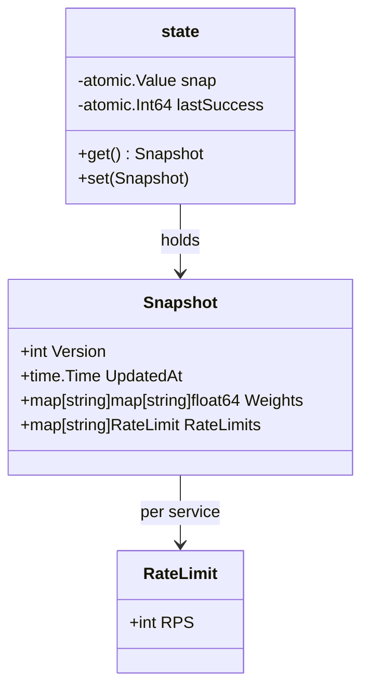
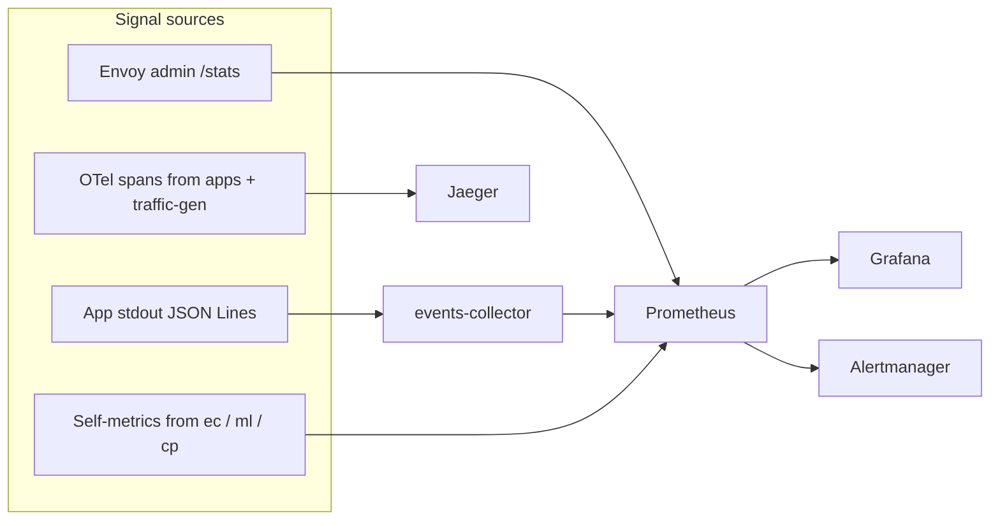

# Architecture

This document describes the geo-distributed-gateway from the top down: what the
system is, what its containers are, how data flows through it, and what state
lives where. It is meant to be readable end-to-end by someone who has never
touched the codebase.

Cross-references:

- HTTP wire contracts — [`openapi.yaml`](openapi.yaml)
- Design rationale — [`ADR.md`](ADR.md)
- Functional / non-functional requirements — [`Requirements.md`](Requirements.md)
- Operational procedures — [`Runbook.md`](Runbook.md)

## 1. What this is

A two-datacenter HTTP gateway that exposes a fleet of stub backends over a
single public endpoint and adapts cross-zone load balancing based on
observed latency / error rates.

| Aspect | Value |
|---|---|
| Topology | 2 datacenters (`zone1`, `zone2`), 5 logical services × 2 zones = 10 backend instances |
| Public entry | `http://localhost:10000` (global Envoy) |
| Discovery | Consul, single-DC dev agent, tag-based DNS |
| Adaptive routing | ML heuristic on Prometheus metrics → Control Plane → Envoy Lua filter (per-request weighted zone pinning) |
| Cross-DC config feed | Redis Pub/Sub (`routing:<service>`) |
| Observability | Prometheus metrics, Grafana dashboards, Alertmanager, Jaeger OTLP tracing, app-stdout telemetry events |
| Runtime | Docker Compose, ~21 containers, Go 1.26 services, Envoy 1.36 data plane |

## 2. What this is NOT

Deliberate scope limits (see [`ADR.md`](ADR.md) §1.1):

- No mTLS between zones
- No support for more than 2 datacenters
- No online ML inference (recommendations are computed offline from rolling metrics windows)
- Not deployable on Kubernetes / Nomad without rewrite
- No xDS gRPC discovery (Consul DNS is the only discovery protocol)

## 3. System Context (C4 — L1)



The system has two kinds of consumers:

1. **HTTP clients** hit a single public port `:10000` and address logical
   services by URL prefix (`/service-{a..e}/...`).
2. **Operators** read Grafana dashboards, Jaeger traces, and the Consul UI
   directly.

## 4. Container View (C4 — L2)


(Edges to `s1a` / `s2a` represent the same wiring for every `service-{a..e}` instance.)

### Containers, in one line each

| Container | Role |
|---|---|
| `global-envoy` | Public L7 entry: path-routes `/service-{X}/*` to `geo_cluster`; Lua filter sets `x-geo` zone pin per request based on weights from `control-plane`; `outlier_detection` on zone endpoints |
| `zone{1,2}-envoy` | Zonal L7: `prefix_rewrite: "/"`, resolves upstreams via Consul DNS (tag-filtered), per-service clusters with health checks |
| `service-{a..e}-zone{1,2}-1` | Stub Go HTTP service on `:8080`; self-registers in Consul on startup; emits telemetry JSON Lines to stdout; OTel-instrumented; subscribes to routing hints on Redis |
| `consul` | Single-DC dev-mode service registry + DNS resolver; static IP `172.30.{0,1,2}.5` in each Docker network |
| `redis` | Pub/Sub channel `routing:<service>` for ML-derived routing hints (no persistence — `--save "" --appendonly no`) |
| `jaeger` | All-in-one tracing backend, receives OTLP HTTP on `:4318`, UI on `:16686` |
| `prometheus` | Scrapes Envoy admin endpoints, all custom services, Alertmanager; 8 alert rules |
| `grafana` | Dashboards over Prometheus (anonymous admin) |
| `alertmanager` | Alert routing |
| `events-collector` | Subscribes to Docker stdout of containers labelled `gateway.component=app`, parses telemetry JSON Lines, exposes Prometheus metrics on `:9100/metrics` |
| `ml-analyzer` | Offline heuristic over PromQL: computes per-zone weights and rate-limit suggestions, publishes JSON on `:9200/recommendations` |
| `control-plane` | Pulls `ml-analyzer` every 30s, exposes versioned snapshot on `:9300/config`, publishes per-service changes to Redis |

## 5. Networking

Three Docker bridge networks isolate traffic:

| Network | Subnet | Members |
|---|---|---|
| `global-net` | `172.30.0.0/24` | all observability, support services, both `consul` and `redis` (multi-attached), `global-envoy`, `zone-envoy`s, `jaeger` |
| `zone1-net` | `172.30.1.0/24` | `zone1-envoy`, all `service-*-zone1-1`, multi-attached `consul`/`jaeger`/`redis` |
| `zone2-net` | `172.30.2.0/24` | `zone2-envoy`, all `service-*-zone2-1`, multi-attached `consul`/`jaeger`/`redis` |

`consul`, `jaeger`, and `redis` are deliberately attached to all three networks
so that zone-only containers (apps, zone-envoys) can reach them without
crossing through `global-envoy`.

`consul` uses pinned IPv4 addresses (`172.30.{0,1,2}.5`) because Envoy
`dns_resolvers.address` requires an IP literal, not a hostname.

## 6. Request flow (happy path)

```mermaid
sequenceDiagram
    autonumber
    participant C as Client
    participant GE as global-envoy
    participant CP as control-plane
    participant ZE as zone{1,2}-envoy
    participant CON as consul (DNS)
    participant APP as service-X-zoneN-1
    participant J as jaeger

    C->>GE: GET /service-a/ping<br/>(W3C traceparent if instrumented)
    Note over GE: Lua filter on_request:<br/>cache hit? use cached weights<br/>cache miss? httpCall control-plane
    GE-->>CP: GET /config/weights/service-a<br/>(only on cache miss, TTL 30s)
    CP-->>GE: {"zone1":0.6,"zone2":0.4}
    Note over GE: weighted random ->; add x-geo: zone1
    GE->>ZE: forward with x-geo + traceparent
    Note over ZE: route by prefix /service-a/;<br/>prefix_rewrite "/";<br/>cluster service-a-zoneN-cluster
    ZE->>CON: A-lookup zoneN.service-a.service.consul (DNS:8600)
    CON-->>ZE: IP of service-a-zoneN-1
    ZE->>APP: GET /ping
    Note over APP: otelhttp creates server span;<br/>handler annotates user_id, cabinet_id, zone;<br/>emits JSON telemetry to stdout
    APP-->>ZE: 200 + X-Served-By
    ZE-->>GE: 200
    GE-->>C: 200 + X-Served-By
    APP-->>J: OTLP span (async, batched)
    GE-->>J: OTLP span (async, batched)
```

Key invariants:

- App services listen on bare `/ping` and `/health`; the `/service-{X}/` URL
  prefix is stripped by `prefix_rewrite: "/"` in zone-envoy.
- `x-geo` header has two consumers: the Lua filter sets it; existing
  `header.x-geo` routes in `global-envoy.yaml` consume it. Explicit
  client-side `x-geo: zone1|zone2` bypasses the Lua choice (used by failure
  tests).
- If the client doesn't ship a `traceparent`, server span becomes a root.

## 7. Adaptive routing cycle



There are two consumers of the snapshot:

1. **Lua filter in global-envoy** pulls per-service flat weights synchronously
   from `:9300/config/weights/<svc>` on cache miss; this is what actually
   shapes traffic.
2. **App services** subscribe to Redis `routing:<service>` and currently only
   log received hints. This is the v1 plumbing for future self-throttling
   consumers.

Both paths feed off the same `Snapshot` struct (`version, updated_at, weights,
rate_limits`) held in-memory in `control-plane`.

## 8. Failover (zone outage)

```mermaid
sequenceDiagram
    autonumber
    participant C as Client / traffic-gen
    participant GE as global-envoy
    participant ZE1 as zone1-envoy
    participant ZE2 as zone2-envoy
    participant S1 as service-X-zone1-1
    participant S2 as service-X-zone2-1

    C->>GE: GET /service-X/ping
    GE->>ZE1: forward (Lua picked zone1)
    ZE1->>S1: GET /ping
    S1--xZE1: connect_failure (container stopped by failure-runner)
    Note over ZE1: outlier_detection: ejects S1 endpoint;<br/>cluster has no more endpoints
    ZE1--xGE: 503 no_healthy_upstream
    Note over GE: retry_policy: connect-failure,refused-stream,gateway-error,reset<br/>retries -> 2;<br/>geo_cluster has zone1_envoy AND zone2_envoy as endpoints
    GE->>ZE2: retry on zone2_envoy endpoint
    ZE2->>S2: GET /ping
    S2-->>ZE2: 200
    ZE2-->>GE: 200
    GE-->>C: 200 + X-Served-By: service-X-zone2-1
```

This relies on three pieces working together:

- `geo_cluster` in `global-envoy.yaml` lists **both** zone envoys as endpoints
  with `outlier_detection`, so when one is ejected the cluster fails over
  automatically (rather than `weighted_clusters` which would re-pick the
  same cluster on retry — see ADR).
- `retry_policy` allows the retry to be served by a different endpoint.
- Validation: `make failure-zone1` stops every container in zone1 for 30s and
  asserts error rate stays under 5% during the outage.

## 9. Service self-registration

```mermaid
sequenceDiagram
    autonumber
    participant SVC as service-X-zoneN-1 (Go binary)
    participant C as Consul agent

    Note over SVC: startup: read SERVICE_NAME, ZONE, CONSUL_ADDR env;<br/>resolve own IP via net.InterfaceAddrs()
    SVC->>C: agent.ServiceRegister(name=service-X, id=service-X-zoneN-1,<br/>tags=[zoneN], address=<own_ip>, port=8080,<br/>check=HTTP /health every 5s)
    C-->>SVC: ok
    Note over SVC: serve HTTP /ping, /health
    Note over SVC: SIGTERM
    SVC->>C: agent.ServiceDeregister(service-X-zoneN-1)
    C-->>SVC: ok
    Note over SVC: srv.Shutdown(15s timeout)
```

Best-effort: any failure (Consul unreachable, registration error) is logged
and the service keeps serving HTTP. This avoids a cascading restart of all
10 apps if Consul flaps.

## 10. Component internals (selected)

### 10.1 control-plane state



- `Snapshot` is held in an `atomic.Value` — readers (HTTP handlers, Redis
  publisher loop) never block on the poll goroutine.
- `Version` increments only when content changes (`reflect.DeepEqual` on
  weights+limits); identical pulls leave it alone.
- `lastSuccess` (UnixNano gauge) drives both `/healthz` freshness and
  `control_plane_age_seconds` metric.

### 10.2 ml-analyzer heuristic

For each `(service, zone)` pair, every `-interval`:

```text
p99_ms = histogram_quantile(0.99, rate(envoy_cluster_upstream_rq_time_bucket[5m]))
rps    = sum(rate(envoy_cluster_upstream_rq_total[5m]))
err    = sum(rate(envoy_cluster_upstream_rq_xx{class="5"}[5m]))

score   = 1 / (1 + p99_ms/100) * (1 - error_rate)
weights = normalise(scores) per service so that sum(zone1, zone2) == 1.0
rps_rec = max(zone_rps_per_service) * 1.5   # fallback: 100
```

No model training, no historical retention — pure rolling-window arithmetic.

### 10.3 Lua score filter

Per-worker (typically 2-4 workers in Envoy) state:

```text
cache[service] = { weights = {zone1, zone2}, exp = epoch_seconds }
TTL_SECONDS = 30
```

On request:

```text
if client provided x-geo:zone1|zone2 -> respect, return
service = parse from :path (default service-a)
weights = cache[service] if fresh, else httpCall(control-plane), cache on success only
zone    = weighted random
add x-geo header
```

Cache misses cost one synchronous `httpCall` (~5ms p99); cache hits are
in-process Lua table lookups.

## 11. State / data stores

| Where | What | Lifetime | Persistence |
|---|---|---|---|
| `control-plane` in-memory `atomic.Value` | Latest `Snapshot{version, weights, rate_limits}` | Process | None — restart resets `version` to 0 |
| `consul` (dev mode) | Service catalog | Process | None — `-dev` is in-memory |
| `redis` | Pub/Sub channel `routing:<service>` | Per message | None — `--save "" --appendonly no` |
| `prometheus` | 7d local TSDB | 7 days | Disk (volume) |
| `jaeger` (all-in-one) | Recent spans | In-memory cap | None |
| `app` services | None (stateless) | n/a | n/a |
| Envoy admin / clusters | Endpoint health | Process | None — re-resolved every `dns_refresh_rate=5s` |

Nothing in the gateway path is durable — by design, this is a routing layer,
not a system of record.

## 12. Observability fabric



Three independent pipelines:

1. **Metrics** (Prometheus pull): Envoy admin endpoints + custom service
   self-metrics + events-collector aggregations from app stdout.
2. **Traces** (OTel push): traffic-gen and app services export OTLP HTTP to
   Jaeger, including W3C trace context propagation across hops.
3. **Logs**: `slog` JSON to stderr is left to `docker logs`; app telemetry
   events on stdout are consumed only by events-collector (deliberate split,
   see `Logging & telemetry` conventions).

## 13. Cardinality discipline

`events-collector` and `control-plane` deliberately keep Prometheus label
sets small:

| Metric | Labels | Max series |
|---|---|---|
| `events_total` | `service, zone, kind` | 5 × 2 × 4 = 40 |
| `requests_total` | `service, zone, status_class` | 5 × 2 × 4 = 40 |
| `errors_total` | `service, zone` | 5 × 2 = 10 |
| `request_latency_ms` | `service, zone` (histogram, 11 buckets) | ~110 |
| `control_plane_redis_publishes_total` | `service, result` | 5 × 2 = 10 |

`user_id` and `cabinet_id` are intentionally NOT Prometheus labels — they
go into Jaeger span attributes only. This caps total cardinality at well
under 500 series for the whole gateway.

## 14. Build & run

| Action | Command |
|---|---|
| Start | `make up` |
| Stop | `make down` |
| Status | `make status` |
| Smoke load (100 RPS × 30s) | `make traffic-gen` |
| Zone-1 outage chaos test | `make failure-zone1` |
| Partial outage (half of zone1) | `make failure-partial` |

Each Go binary builds inside its own multi-stage Dockerfile with an inline
`go.work` so the local `replace ../../sdk` directive resolves without
touching network. See `app/Dockerfile` / `cmd/*/Dockerfile`.

## 15. Read next

| If you want to understand… | Read |
|---|---|
| Why each piece is the way it is | [`ADR.md`](ADR.md) |
| What the system must do / NFRs | [`Requirements.md`](Requirements.md) |
| How to operate / debug it | [`Runbook.md`](Runbook.md) |
| Exact HTTP request / response shapes | [`openapi.yaml`](openapi.yaml) |
| How to run it locally | [`../README.md`](../README.md) |
