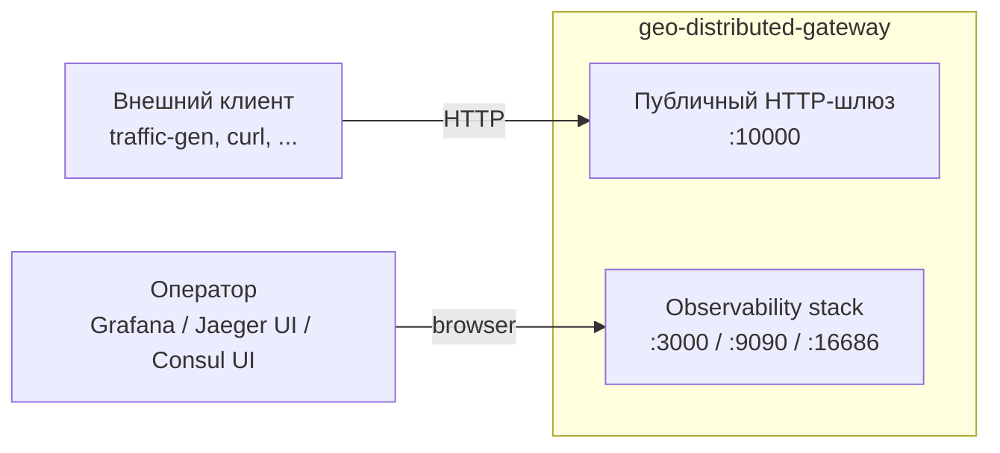
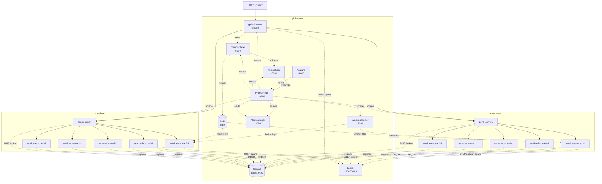
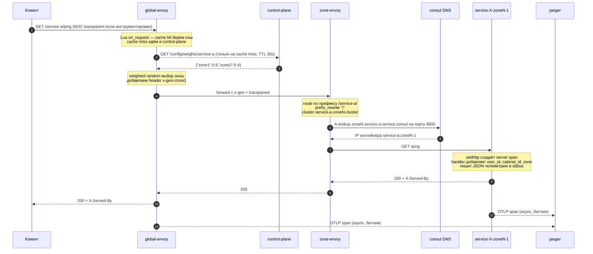
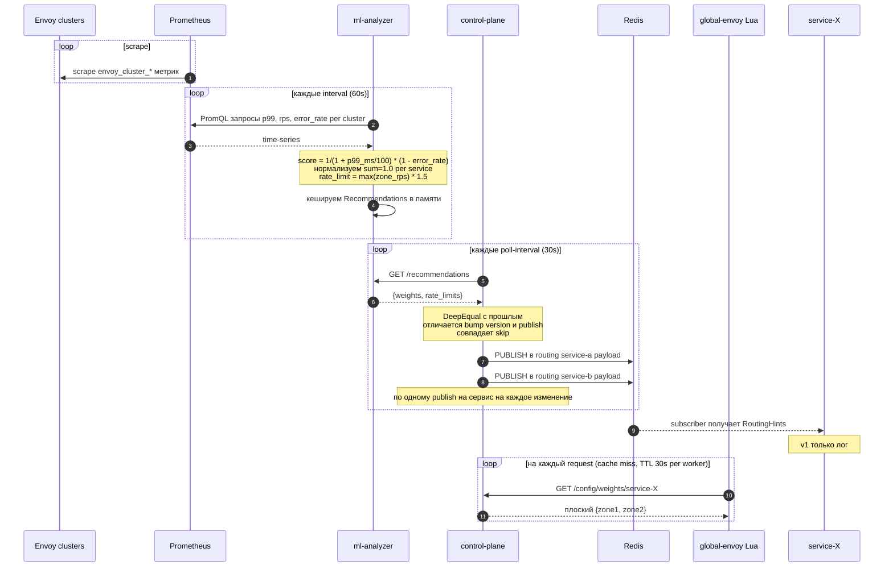
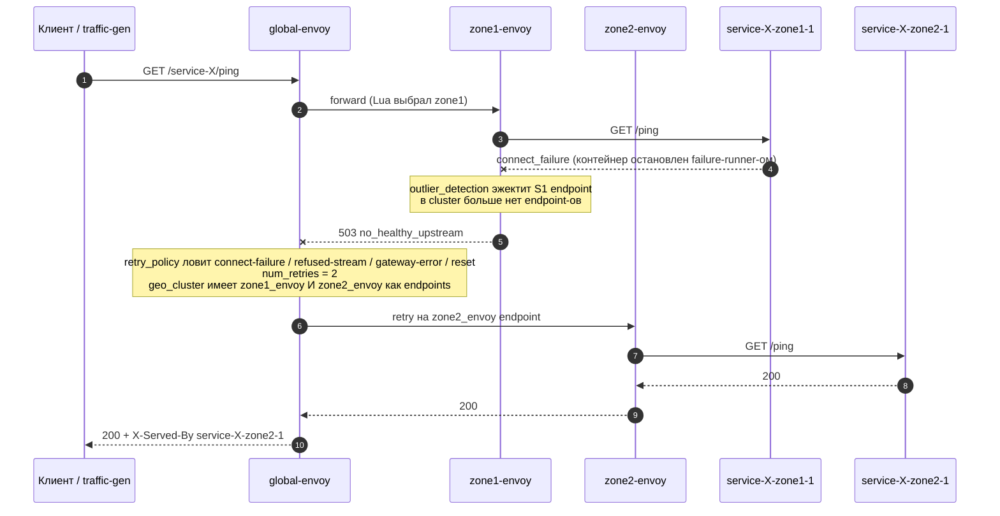
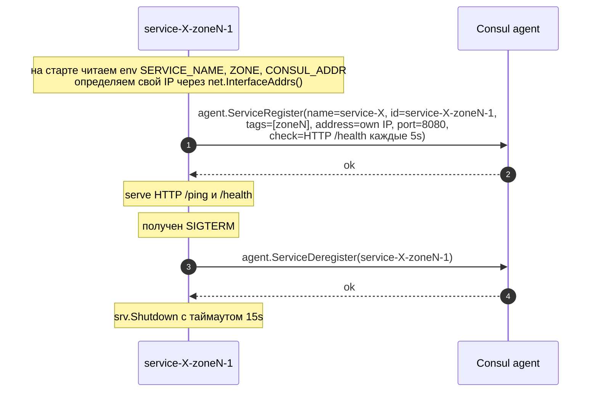
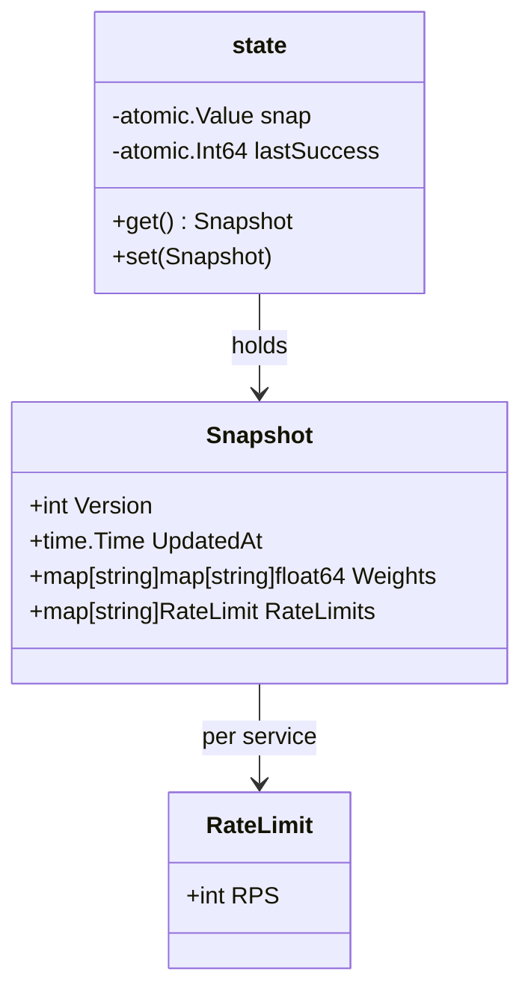
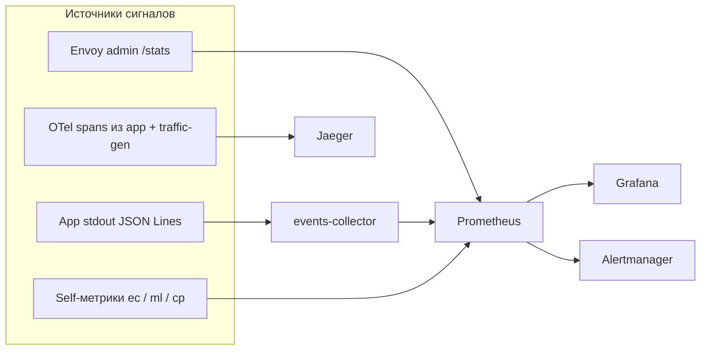

# Архитектура

Документ описывает geo-distributed-gateway сверху вниз: что это за система,
какие у неё контейнеры, как через неё проходят данные и где какое состояние
живёт. Рассчитан на чтение целиком человеком, который никогда не открывал
этот репозиторий.

Связанные документы:

- HTTP wire-контракты — [`openapi.yaml`](openapi.yaml)
- Обоснования архитектурных решений — [`ADR.md`](ADR.md)
- Функциональные и нефункциональные требования — [`Requirements.md`](Requirements.md)
- Операционные процедуры — [`Runbook.md`](Runbook.md)

## 1. Что это

HTTP-шлюз на два дата-центра, который выставляет наружу набор stub-бэкендов
через одну публичную точку входа и адаптивно балансирует кросс-зональную
нагрузку на основе наблюдаемой latency / error rate.

| Параметр | Значение |
|---|---|
| Топология | 2 ДЦ (`zone1`, `zone2`), 5 логических сервисов × 2 зоны = 10 бэкенд-инстансов |
| Публичный вход | `http://localhost:10000` (global Envoy) |
| Discovery | Consul, single-DC dev agent, tag-based DNS |
| Адаптивная маршрутизация | ML-эвристика на метриках Prometheus → Control Plane → Envoy Lua-фильтр (per-request weighted zone pinning) |
| Cross-DC config feed | Redis Pub/Sub (`routing:<service>`) |
| Observability | Prometheus-метрики, Grafana-дашборды, Alertmanager, Jaeger OTLP-трейсинг, telemetry-события из app stdout |
| Runtime | Docker Compose, ~21 контейнер, Go 1.26 сервисы, Envoy 1.36 data plane |

## 2. Что этим НЕ является

Сознательные границы скоупа (см. [`ADR.md`](ADR.md) §1.1):

- Нет mTLS между зонами
- Нет поддержки более 2 дата-центров
- Нет online ML-инференса (рекомендации считаются офлайн по rolling window метрик)
- Не разворачивается на Kubernetes / Nomad без переписывания
- Нет xDS gRPC discovery (Consul DNS — единственный протокол discovery)

## 3. System Context (C4 — L1)



У системы два типа потребителей:

1. **HTTP-клиенты** ходят на один публичный порт `:10000` и адресуют
   логические сервисы префиксом URL (`/service-{a..e}/...`).
2. **Операторы** напрямую читают Grafana, Jaeger и Consul UI.

## 4. Container View (C4 — L2)



(Стрелки к `s1a` / `s2a` представляют такую же связку для каждого `service-{a..e}`-инстанса.)

### Контейнеры, по одной строке на каждый

| Контейнер | Роль |
|---|---|
| `global-envoy` | Публичный L7-вход: path-route `/service-{X}/*` в `geo_cluster`; Lua-фильтр проставляет `x-geo` zone-pin per request по весам из `control-plane`; `outlier_detection` на zone-endpoints |
| `zone{1,2}-envoy` | Зональный L7: `prefix_rewrite: "/"`, резолвит апстримы через Consul DNS (tag-filtered), per-service кластеры с health checks |
| `service-{a..e}-zone{1,2}-1` | Stub Go HTTP-сервис на `:8080`; при старте сам регистрируется в Consul; пишет JSON-телеметрию в stdout; инструментирован OTel; подписан на routing-hints через Redis |
| `consul` | Single-DC dev-mode service registry + DNS resolver; статический IP `172.30.{0,1,2}.5` в каждой Docker-сети |
| `redis` | Pub/Sub-канал `routing:<service>` для ML-рекомендаций (без персистентности — `--save "" --appendonly no`) |
| `jaeger` | All-in-one tracing-бэкенд, принимает OTLP HTTP на `:4318`, UI на `:16686` |
| `prometheus` | Скрапит Envoy admin-эндпоинты, все кастомные сервисы, Alertmanager; 8 alert-правил |
| `grafana` | Дашборды поверх Prometheus (anonymous admin) |
| `alertmanager` | Маршрутизация алертов |
| `events-collector` | Подписан на Docker stdout контейнеров с лейблом `gateway.component=app`, парсит JSON-события телеметрии, экспонирует Prometheus-метрики на `:9100/metrics` |
| `ml-analyzer` | Офлайн-эвристика на PromQL: считает per-zone веса и рекомендации rate-limit, публикует JSON на `:9200/recommendations` |
| `control-plane` | Каждые 30s pull-ит `ml-analyzer`, держит версионированный снапшот на `:9300/config`, публикует per-service изменения в Redis |

## 5. Сети

Три Docker bridge-сети изолируют трафик:

| Сеть | Подсеть | Участники |
|---|---|---|
| `global-net` | `172.30.0.0/24` | весь observability stack, support-сервисы, `consul`/`redis` (multi-attached), `global-envoy`, оба `zone-envoy`, `jaeger` |
| `zone1-net` | `172.30.1.0/24` | `zone1-envoy`, все `service-*-zone1-1`, multi-attached `consul`/`jaeger`/`redis` |
| `zone2-net` | `172.30.2.0/24` | `zone2-envoy`, все `service-*-zone2-1`, multi-attached `consul`/`jaeger`/`redis` |

`consul`, `jaeger` и `redis` намеренно подключены ко всем трём сетям, чтобы
zone-only контейнеры (app и zone-envoy) ходили к ним без перехода через
`global-envoy`.

У `consul` фиксированные IPv4 (`172.30.{0,1,2}.5`), потому что Envoy
`dns_resolvers.address` принимает только IP-литерал, не hostname.

## 6. Поток запроса (happy path)



Ключевые инварианты:

- App-сервисы слушают bare `/ping` и `/health`; префикс `/service-{X}/`
  снимается через `prefix_rewrite: "/"` в zone-envoy.
- Header `x-geo` имеет двух потребителей: Lua-фильтр его проставляет; уже
  существующие `header.x-geo` routes в `global-envoy.yaml` его читают.
  Явный клиентский `x-geo: zone1|zone2` обходит выбор Lua (используется в
  failure-тестах).
- Если клиент не прислал `traceparent`, server span становится корневым.

## 7. Цикл адаптивной маршрутизации



У снапшота два потребителя:

1. **Lua-фильтр в global-envoy** синхронно pull-ит per-service плоские веса
   с `:9300/config/weights/<svc>` на cache miss — именно это реально
   формирует трафик.
2. **App-сервисы** подписаны на Redis `routing:<service>` и сейчас только
   логируют полученные подсказки. Это v1-каркас для будущих
   self-throttling consumer-ов.

Оба пути используют один и тот же `Snapshot` (`version, updated_at, weights,
rate_limits`), который держится in-memory в `control-plane`.

## 8. Failover (отказ зоны)



Работает за счёт связки трёх вещей:

- `geo_cluster` в `global-envoy.yaml` содержит **оба** zone-envoy как
  endpoints с `outlier_detection` — когда один эжектится, кластер
  автоматически перенаправляет на оставшийся (в отличие от
  `weighted_clusters`, который при retry заново выбрал бы тот же кластер
  — см. ADR).
- `retry_policy` разрешает retry на другом endpoint.
- Валидация: `make failure-zone1` останавливает все контейнеры zone1 на 30s
  и проверяет, что error rate во время отказа остаётся ниже 5%.

## 9. Самостоятельная регистрация сервисов



Best-effort: любая ошибка (Consul недоступен, ошибка регистрации) логируется,
сервис продолжает обслуживать HTTP. Это предотвращает каскадный рестарт
всех 10 app-контейнеров при флапе Consul.

## 10. Внутреннее устройство компонент (избранное)

### 10.1 control-plane state



- `Snapshot` хранится в `atomic.Value` — читатели (HTTP-хендлеры,
  Redis-publisher) никогда не блокируются на poll-горутине.
- `Version` инкрементируется только при изменении содержимого
  (`reflect.DeepEqual` по weights+limits); идентичный pull не двигает её.
- `lastSuccess` (UnixNano gauge) питает и freshness в `/healthz`, и
  метрику `control_plane_age_seconds`.

### 10.2 эвристика ml-analyzer

Для каждой пары `(service, zone)` каждый `-interval`:

```text
p99_ms = histogram_quantile(0.99, rate(envoy_cluster_upstream_rq_time_bucket[5m]))
rps    = sum(rate(envoy_cluster_upstream_rq_total[5m]))
err    = sum(rate(envoy_cluster_upstream_rq_xx{class="5"}[5m]))

score   = 1 / (1 + p99_ms/100) * (1 - error_rate)
weights = normalise(scores) per service, так чтобы sum(zone1, zone2) == 1.0
rps_rec = max(zone_rps_per_service) * 1.5   # fallback: 100
```

Никакого обучения моделей, никакой исторической retention — чистая
арифметика на rolling-window.

### 10.3 Lua-фильтр score

Per-worker state (обычно 2-4 воркера у Envoy):

```text
cache[service] = { weights = {zone1, zone2}, exp = epoch_seconds }
TTL_SECONDS = 30
```

На запрос:

```text
если клиент прислал x-geo:zone1|zone2 -> уважаем, return
service = распарсить из :path (default service-a)
weights = cache[service] если свежий, иначе httpCall(control-plane), кешируем только при успехе
zone    = weighted random
add x-geo header
```

Cache miss стоит один синхронный `httpCall` (~5ms p99); cache hit — это
in-process Lua-table lookup.

## 11. Состояние / хранилища

| Где | Что | Время жизни | Персистентность |
|---|---|---|---|
| `control-plane` in-memory `atomic.Value` | Последний `Snapshot{version, weights, rate_limits}` | Процесс | Нет — рестарт обнуляет `version` |
| `consul` (dev mode) | Каталог сервисов | Процесс | Нет — `-dev` всё в памяти |
| `redis` | Канал `routing:<service>` | Per message | Нет — `--save "" --appendonly no` |
| `prometheus` | TSDB на 7d | 7 дней | Диск (volume) |
| `jaeger` (all-in-one) | Недавние spans | In-memory cap | Нет |
| `app`-сервисы | Нет (stateless) | n/a | n/a |
| Envoy admin / clusters | Health endpoint-ов | Процесс | Нет — пересчитывается каждые `dns_refresh_rate=5s` |

Ничего на пути запроса не персистентно — by design, это маршрутизирующий
слой, а не system of record.

## 12. Observability fabric



Три независимых пайплайна:

1. **Метрики** (Prometheus pull): Envoy admin-эндпоинты + self-метрики
   кастомных сервисов + агрегации events-collector из app stdout.
2. **Трейсы** (OTel push): traffic-gen и app-сервисы экспортируют OTLP HTTP
   в Jaeger, включая распространение W3C trace context между хопами.
3. **Логи**: `slog` JSON в stderr оставляем для `docker logs`; telemetry
   события на stdout читает только events-collector (намеренное разделение
   — см. конвенции «Logging & telemetry»).

## 13. Дисциплина кардинальности

`events-collector` и `control-plane` намеренно держат label set
Prometheus-метрик маленьким:

| Метрика | Лейблы | Max series |
|---|---|---|
| `events_total` | `service, zone, kind` | 5 × 2 × 4 = 40 |
| `requests_total` | `service, zone, status_class` | 5 × 2 × 4 = 40 |
| `errors_total` | `service, zone` | 5 × 2 = 10 |
| `request_latency_ms` | `service, zone` (histogram, 11 buckets) | ~110 |
| `control_plane_redis_publishes_total` | `service, result` | 5 × 2 = 10 |

`user_id` и `cabinet_id` сознательно НЕ являются Prometheus-лейблами —
они идут только в Jaeger span attributes. Это удерживает суммарную
кардинальность всего шлюза существенно ниже 500 серий.

## 14. Сборка и запуск

| Действие | Команда |
|---|---|
| Запуск | `make up` |
| Остановка | `make down` |
| Статус | `make status` |
| Smoke-нагрузка (100 RPS × 30s) | `make traffic-gen` |
| Хаос-тест: отказ zone1 | `make failure-zone1` |
| Частичный отказ (половина zone1) | `make failure-partial` |

Каждый Go-бинарь собирается в собственном multi-stage Dockerfile с inline
`go.work`, чтобы локальная директива `replace ../../sdk` резолвилась без
обращения к сети. См. `app/Dockerfile` / `cmd/*/Dockerfile`.

## 15. Что читать дальше

| Если хочется разобраться в… | Читать |
|---|---|
| Почему каждая деталь сделана так, как сделана | [`ADR.md`](ADR.md) |
| Что система должна делать / NFR | [`Requirements.md`](Requirements.md) |
| Как эксплуатировать и дебажить | [`Runbook.md`](Runbook.md) |
| Точные формы HTTP request / response | [`openapi.yaml`](openapi.yaml) |
| Как поднять локально | [`../README.md`](../README.md) |
